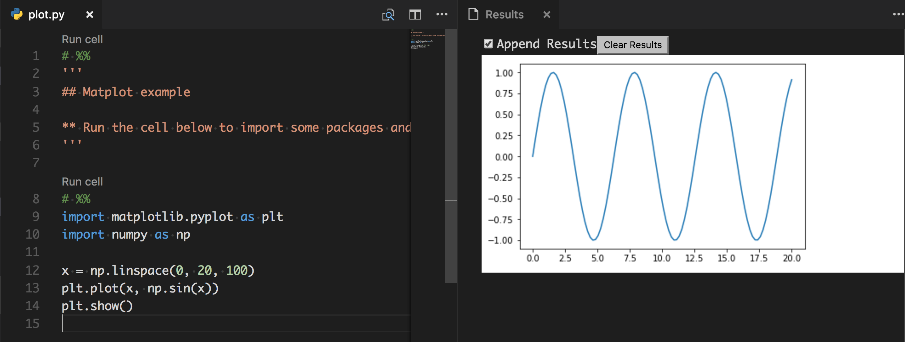

# vscode-ipynb-py-convert

[Jupyter plugin for vscode](https://marketplace.visualstudio.com/items?itemName=donjayamanne.jupyter) allows creating a python file with the ability to run cells using `code lens` and `preview` extension apis.

Lots more [Jupyter python vscode examples](https://github.com/DonJayamanne/pythonVSCode/wiki/Jupyter-Examples)

[vscode-ipynb-py-convert](https://pypi.python.org/pypi/vscode-ipynb-py-convert) python module converts ipynb->py and py->ipynb.

## Example

`python -m vscode-ipynb-py-convert examples/plot.py examples/plot.ipynb`

or

`python -m vscode-ipynb-py-convert examples/plot.ipynb examples/plot.py`

**VSCode**

Markdown cells are converted to python multiline strings `'''`. Code cells are left as is. `# %%` is used by vscode as the cell marker on which 'Run Cell' action is available.

**Jupyter ipynb notebook**

